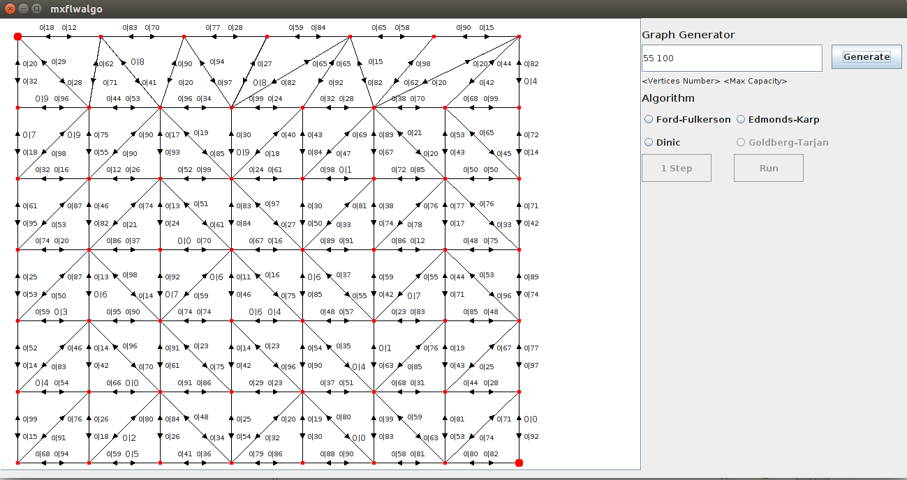

# Maximum Flow Algorithms
Implementation of some classic algorithms solving the general maximum flow problem:
* *Ford-Fulkerson*
* *Edmonds-Karp*
* *Dinic*
* *Goldberg-Tarjan* (also known as *Preflow-Push* or *Push-Relabel*)

The algorithms are visualized for an auto-generated maximal-planar graph of any given
size (which is the number of vertices and the maximal arc capacity). User can choose between 
running the whole algorithm at once with a given delay between the intermediate steps and running 
one single step of the algorithm. The vertices and arcs are highlighted accordingly.

###### GUI showing a generated maximal-planar graph containing 55 vertices and a max arc capacity of 100:

###### Ford-Fulkerson running on a 55-vertex-graph. The flow augmenting paths found by DFS are highlighted:

###### Edmonds-Karp running on a 55-vertex-graph. The flow augmenting paths found by BFS are highlighted:

###### Dinic running on a 55-vertex-graph. The blocking flows are highlighted:

###### Goldberg-Tarjan running on a 55-vertex-graph. The current pushing flow is highlighted, red border indicates a node with excess, green color indicates the a push, yellow color indicates a relabel:

